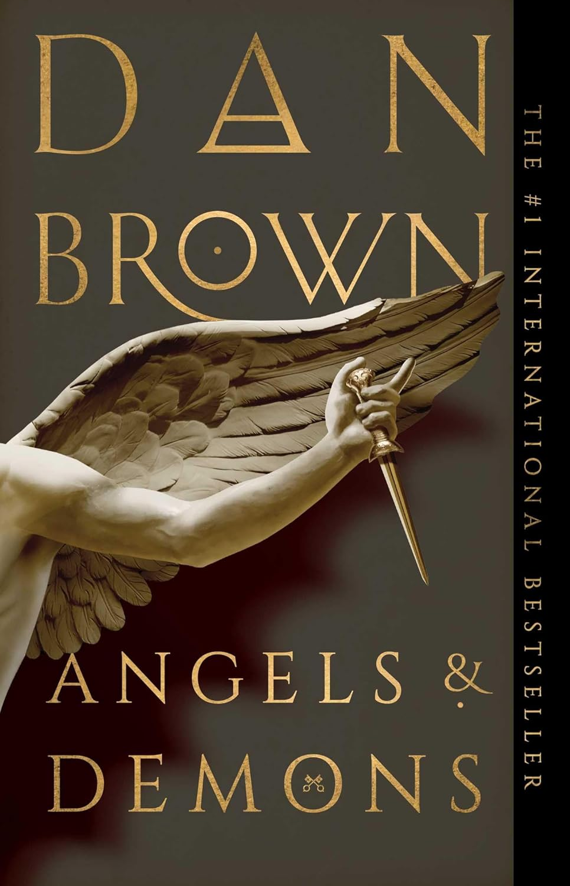

### Review of _Angels & Demons_ by Dan Brown

_Angels & Demons_ is the first book in the Robert Langdon series by Dan Brown. Langdon is an American professor at Harvard University, a historian and symbologist, whose expertise draws him into this fast-paced adventure.

The story begins with his knowledge of the Illuminati - a secretive organization often mistaken for a cult but, in the book, portrayed more as a historical society of scientists. This connection pulls him into a plot filled with intrigue, action, and mystery.

### Writing Style and Structure

The book is marketed as a thriller, and while it certainly has moments of suspense and some cruel, intense scenes, I found it more of an adventure with touches of mystery. The writing style is straightforward, which made it very easy to read, even for me as a non-native English speaker. I finished it in about two weeks during my summer vacation.

However, one thing I didn’t enjoy was the structure. The chapters are extremely short and written almost like a movie script. The action often cuts off suddenly, switching to another character’s perspective happening in parallel. While this builds tension and cinematic effect, for me it felt distracting, especially if I wasn’t reading the book in one sitting.

### Book vs. Movie

I had already watched the movie before reading the book, so I knew the main plot twist. Still, the book made me doubt myself at times. It was written in such a way that I wondered if the ending would turn out differently. In the end, the twist was the same, though the book contained more violent or graphic elements compared to the film. For readers who haven’t seen the movie, I think the ending would feel much more surprising and impactful.

### Final Thoughts

Overall, I really enjoyed _Angels & Demons_. It’s engaging, easy to read, and has an exciting story. My main criticism is the overly cinematic structure, which I personally found less appealing.

I’m definitely planning to continue with the series. Since I haven’t seen the movies for the later books, I expect the next ones to be even more thrilling. I’m also looking forward to reading more of Dan Brown, especially with the buzz around new releases in this series.

**Rating: 4/5**
