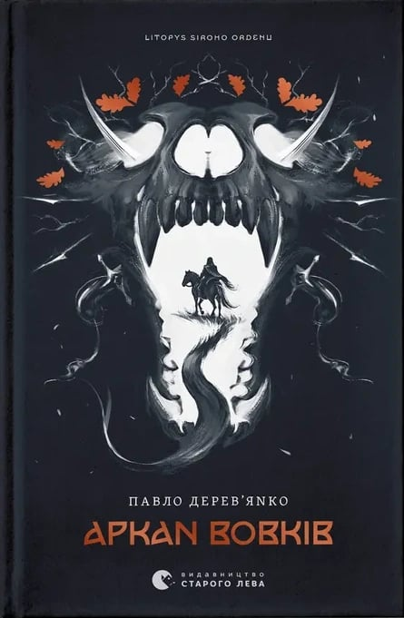

### Book that got me back to reading!

This book hooked me from the very first page. I kept reading and reading, and it honestly felt like I was right there with the characters, living through everything together with them.

What I really loved is how well the story mixes serious, life-changing moments with fun, humor, and friendship. At one point the author even compares the main guys to the three musketeers, and I couldn’t agree more. They have that same bond and energy.

There’s also a little love story in there. Sometimes I caught myself thinking, why are they making such silly choices? But then it hit me: the characters are only 17-18 years old. And I was just as silly at that age too, so it actually felt very real.

I read it in one breath and now I can’t wait for the next book in the series.

**Rating: 5/5**