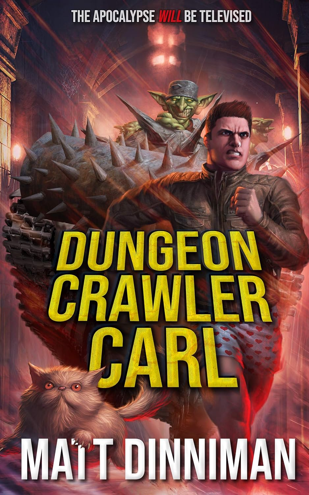

### Review of _Dungeon Crawler Carl_ by Matt Dinni

“Dungeon Crawler Carl” instantly grabs your attention with its wild premise - the Earth has collapsed and turned into a massive dungeon where the survivors must fight to stay alive. From the very first pages, you’re thrown right into the chaos alongside Carl and his cat, Princess Doughnut (she talks and she’s fantastic).

The book starts as a mix of a bit of dark humor and brutal adventure, with a fast pace and an endless variety of challenges for our heroes. It’s creative, unpredictable, and surprisingly addictive. I honestly couldn’t stop reading.

I had never heard of the LitRPG genre before, but this book definitely didn’t disappoint. It’s such a fun mix of game mechanics, humor, and emotional moments that just works perfectly together.

And what I didn’t expect is how much depth it hides under all the action. Toward the end, the story raises moral questions and gives Carl stronger motivations, turning him from a chaotic survivor into a truly compelling character. Can’t say more without spoilers. 

The only slightly odd part for me was the detailed description of ingame menus and HUD elements. Sometimes it felt a bit too literal. But it’s a minor thing in an otherwise fantastic story.

If you like darkly funny post-apocalyptic stories with heart and originality, give this one a go. It’s an absolute blast.

**Rating: 5/5**

