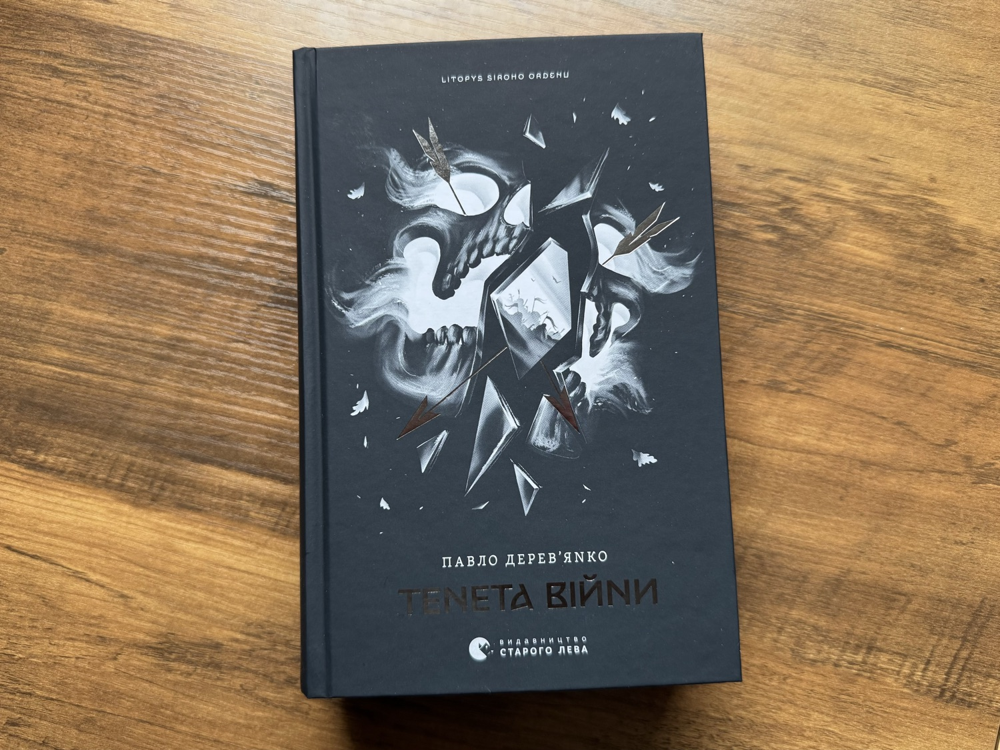

### Review of book 2 of the Grey Order Chronicle (Litopys Siroho Ordenu)

Finished it yesterday evening, and that last chapter hit me hard. The whole book is a lot darker than the first one.

### What it's about (no spoilers)

The story takes place between wars, in the same country we know from book one. By now a great war has already raged in the northeast, and the author spends a lot of time on its consequences: how it changed the main characters, their behavior, the way they live. More wars are coming, and they feel almost inevitable. The heroes are standing at the very beginning of dark times for their country and their Order.

### Structure

Each chapter is split into four parts, one per main character. It reads like a good film or series, with parallel storylines that occasionally cross during the book and then converge into one big culmination at the end.

### Tone

If book one counted as dark fantasy, this one is properly dark. There are a couple of moments that reminded me of the Red Wedding from GRRM, and yes, that kind. The humor and the lighter moments are still there, but there's less of them now, and they don't land quite as funny. They feel more like small bright spots in the dark. It's still incredibly engaging, though.

### What stayed with me

I closed the book and just sat with it for a while. The ending is dramatic as hell, but looking back there were good things in there too. When your country is on the edge of war you can't expect a lot of positives, so the ones you do get, you end up valuing all the more.

A couple of ideas stuck with me. The first one is that even when you're trying to do something good, you can still end up knee-deep in shit. You can do terrible things with the best of intentions and then watch it all get worse and worse, until at some point it slips outside your control entirely.

The second is that truth doesn't really work against well-built manipulation. It won't even get a fair hearing. There's a scene at the Council of Seven in chapter 10 that nails this: it doesn't matter that you have the truth and paper evidence on your side if the setup against you is already almost executed. By that point it's too late. You have to catch these things early, before they take root.

### Quotes I saved

(Translations are mine; the originals are in Ukrainian.)

> Peace is just preparation for the next war.

> The moment he thought how surprisingly easily a new chapter of his life was being written, the moment he saw meaning in it and believed it would always be this way — the pen broke and splattered the page with ink.

> Only a fool doesn't doubt important decisions.

> The biggest mistakes in life are probably made just like that: silently, voluntarily, with sober awareness of what you're doing.

> Childhood dreams have the unpleasant habit of coming true when you no longer need them.

> Never believe in others blindly and without doubt — the disappointment will only hurt more.

### Verdict

If you enjoyed book one, book two is a must. The one caveat is that this is real dark fantasy, so if the darkness in the first book put you off, there's a lot more of it here. But if what drew you in was the realism and the cost of victory, don't miss this one. The war before this book was won, yes, but the author shows you *at what cost*, and makes you question whether that cost was even worth it.

I read book one in about a week. This one took me two, but mostly because I have a one-month-old at home now and my reading time has dropped a lot. Every spare minute went into it. The book grabbed me from the first pages and I just couldn't stop wondering what would happen to the characters next.

**Rating: 5/5.** Excellent Ukrainian prose from Pavlo Derevianko, as always.
